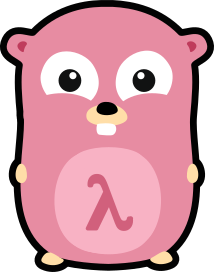

# Stream

# DEPRECATED
I've migrate this repository from github to gitlab, get the lastest version of Steam package at
https://gitlab.com/protocod/stream


Implementation of some functional programing stuff like map, filter and reduce for Golang.

[](https://travis-ci.org/Protoc0d/stream)

> This package is a fork of intertools package which is a translation of the python `itertools` module. It includes all the usual suspects except for the cartesian product and permutation operators. All iterators are `chan interface{}` which allows some type ambiguity for these generic functions. It would be completely ok, however, to reproduce these functions in your package for your type-specific iterators such as `chan MyStruct`. I did this mostly as a thought exercise on converting python generators to Go.

# How to use ?
`Stream` provide implementations of functional iterators to work with specific callback.

```go
type MapCallback func(current interface{}, index int, all Stream) interface{}
type FilterCallback func(current interface{}, index int, all Stream) bool
type ReduceCallback func(memo interface{}, element interface{}) interface{}
```

Go doesn't allow to declare generic type, but we can use a specific struct with contains channel of empty interface to work with all type of value. Stream is the name of this specific type which represent channel of empty interface. You can create instance of Stream using New() function as you can see below.

```go
s := stream.New("Max", "Steve", "Fabio") // Stream of string

minLength := func(current interface{}, index int, all stream.Stream) bool {
  return len(current.(string)) > 3
}

toUpper := func(current interface{}, index int, all stream.Stream) interface{} {
  return strings.ToUpper(current.(string))
}

s = s.Filter(minLength).Map(toUpper) // STEEVE, FABIO
```

Stream type have methods Map, Filter, Reduce from functional programing but also method already known by javascript developer like Every and Some

```go
s := New(2, 4, 6, 8, 10)

isPair := func(current interface{}, index int, all Stream) bool {
  return current.(int)%2 == 0
}

result := <-s.Every(isPair) // result = true
```
Every() verify is each element respect the predicate callback.

```go
s := New(1, 2, 3, 4, 5)

isPair := func(current interface{}, index int, all Stream) bool {
  return current.(int)%2 == 0
}

result := <-s.Some(isPair) // result = true
```
Some() verify if one of them respect the predicate callback.

# Functions availables

## Infinite Stream Creator
```go
func Count(i int) Stream
```
> Infinite count from i

```go
func Cycle(it Stream) Stream
```
> Infinite cycling of `iter` (requires memory)

```go
func Repeat(el interface{}, n ...int) Stream
```
> Repeat element n times (or infinitely)

## Finite Stream Creators

```go
func New(els ...interface{}) Stream
```
> Create from `interface{}` elements

```go
func Int64(els ...int64) Stream
```
> Create from `int32` elements
>
```go
func Int32(els ...int32) Stream
```
> Create from `int64` elements

```go
func Uint(els ...uint) Stream
```
> Create from `uint` elements

```go
func Uint32(els ...uint32) Stream
```
> Create from `uint32` elements

```go
func Uint64(els ...uint64) Stream
```
> Create from `uint64` elements

```go
func Float32(els ...float32) Stream
```
> Create from `float32` elements

```go
func Float64(els ...float64) Stream
```
> Create from `float64` elements
## Stream Destroyers
```go
func (it Stream) Reduce(fn ReduceCallback, memo interface{}) interface{}
```
> Reduce (or Foldl) across the iterator

```go
func List(it Stream) []interface{}
```
> Create a list from the iterator
## Iterator Modifiers
```go
func Chain(its ...Stream) Stream
```
> Chain together multiple iterators

```go
func (it Stream) DropWhile(fn FilterCallback) Stream
```
> Drop elements until `predicate(el) == false`

```go
func (it Stream) TakeWhile(fn FilterCallback) Stream
```
> Take elements until `predicate(el) == false`

```go
func (it Stream) Filter(fn FilterCallback) Stream
```
> Filter out elements when `predicate(el) == false`

```go
func (it Stream) Every(fn FilterCallback) chan bool
```
> Test if all element respect the predicate callback

```go
func (it Stream) Some(fn FilterCallback) chan bool
```
> Test if one of them respect the predicate callback

```go
func (it Stream) Slice(startstopstep ...int) Stream
```
> Drop elements until the start (0-based index). Stop upon stop (exclusive) unless not given. Step is 1 unless given.
## More Iterator Modifiers
```go
func (it Stream) Map(fn MapCallback) Stream
```
> Map each element to `mapper(el)`

```go
func MultiMap(fn MultiMapper, its ...Stream) Stream
```
>Map all the iterators as variadic arguments to `multiMaper(elements...)`. Stop on shortest iterator.

```go
func MultiMapLongest(fn MultiMapper, its ...Stream) Stream
```
>Same as MultiMap except stop on longest iterator. Shorter iterators are filled with `nil` after they are exhausted.

```go
func (it Stream) Starmap(fn MultiMapper) Stream
```
> If iter is an iterator of `[]interface{}`, then expand it into the `multiMapper`.

```go
func Zip(its ...Stream) Stream
```
> Zip multiple iterators together

```go
func ZipLongest(its ...Stream) Stream
```
> Zip multiple iterators together. Take the longest. Shorter ones are appended with `nil`.

```go
func (it Stream) Tee(n int) []Stream
```
> Split an iterator into n equal versions.

```go
func (it Stream) Tee2() (Stream, Stream)
```
> Split an iterator into two equal versions

# Stream is a fork
But stream ins't compatible with intertools because some functions from iterators became method of Stream type and callbacks haven't the same declaration. I've made this choice to have the possibly to chain methods call and to have more informations like index value for each iteration. But features from original intertools package were preserved. The package name come from Java Stream API.

# License

Permission is hereby granted, free of charge, to any person obtaining a copy
of this software and associated documentation files (the "Software"), to deal
in the Software without restriction, including without limitation the rights
to use, copy, modify, merge, publish, distribute, sublicense, and/or sell
copies of the Software, and to permit persons to whom the Software is
furnished to do so, subject to the following conditions:

The above copyright notice and this permission notice shall be included in
all copies or substantial portions of the Software.

THE SOFTWARE IS PROVIDED "AS IS", WITHOUT WARRANTY OF ANY KIND, EXPRESS OR
IMPLIED, INCLUDING BUT NOT LIMITED TO THE WARRANTIES OF MERCHANTABILITY,
FITNESS FOR A PARTICULAR PURPOSE AND NONINFRINGEMENT. IN NO EVENT SHALL THE
AUTHORS OR COPYRIGHT HOLDERS BE LIABLE FOR ANY CLAIM, DAMAGES OR OTHER
LIABILITY, WHETHER IN AN ACTION OF CONTRACT, TORT OR OTHERWISE, ARISING FROM,
OUT OF OR IN CONNECTION WITH THE SOFTWARE OR THE USE OR OTHER DEALINGS IN
THE SOFTWARE.
